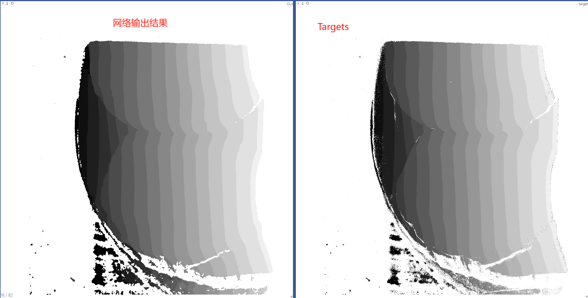
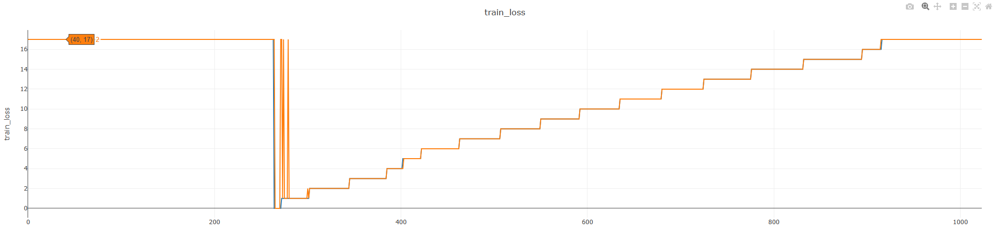
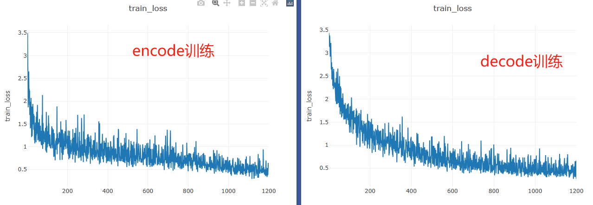
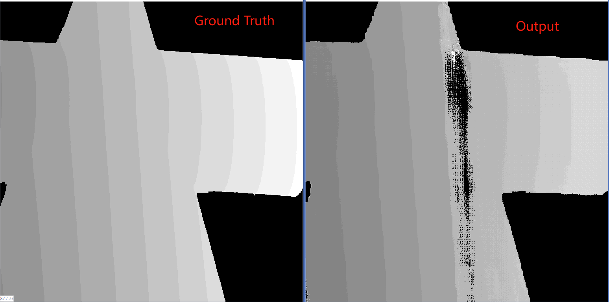
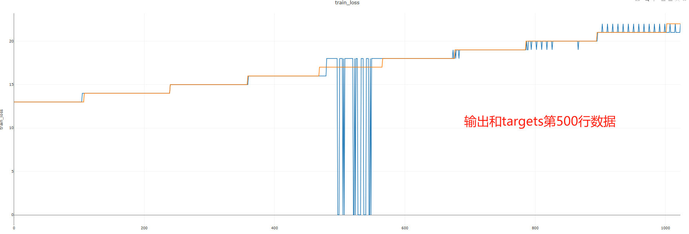
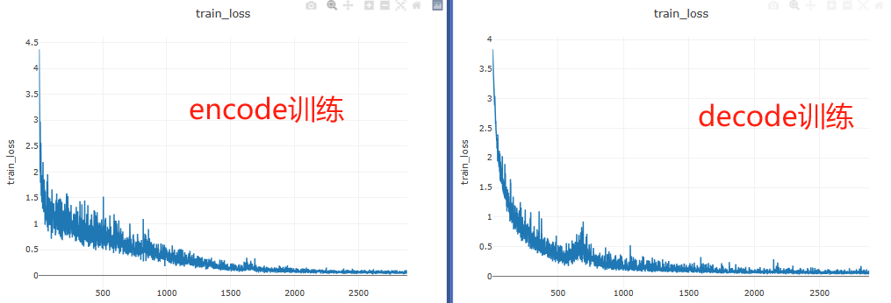
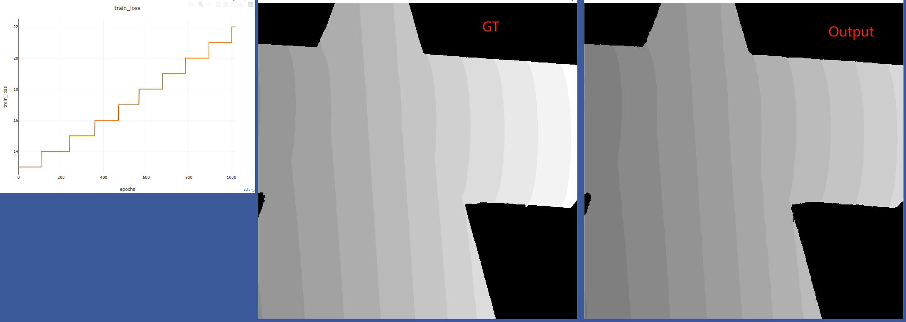
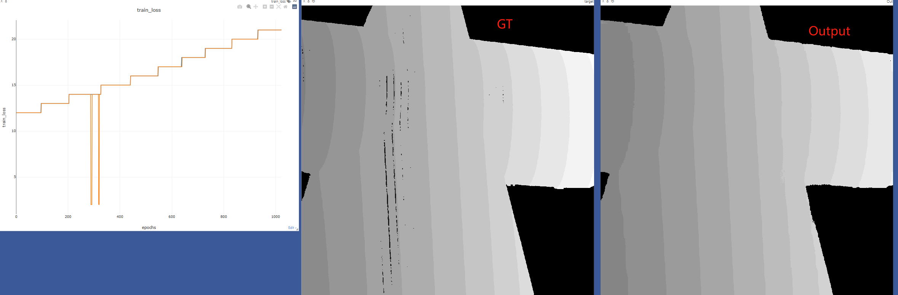
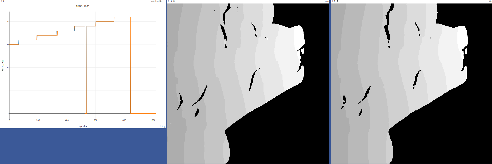

# 项目记录
## 2023.10.07
本项目使用“encode-decode结构”，并且复合多分辨率模型。使用人家的数据集，效果比较好。(150个epoch)
接下来需要用该网络跑我自己的数据。来判断是否是数据集制作有误。

自己的数据(46组数据)，50个epoch训练的结果

## 2023.10.08

使用自己的数据(46组数据)训练150个epoch，训练结果如下所示。**训练结果保存路径：./save/MyDataSet20231008**

网络输出结果：

将attention想法引入该网络